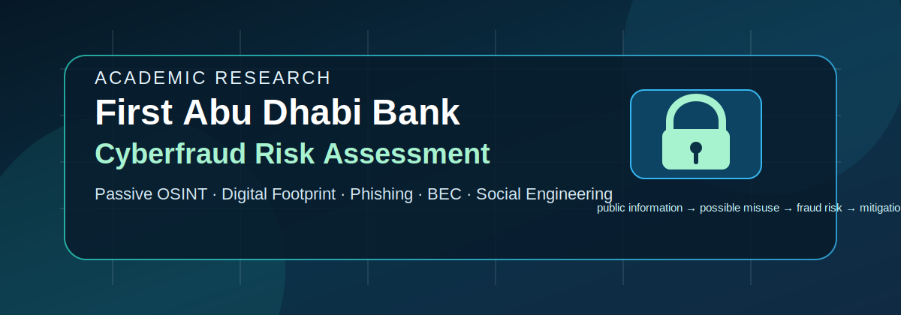
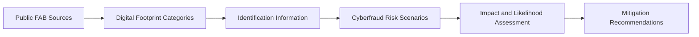

# First Abu Dhabi Bank — Cyberfraud Risk Assessment

<p align="center">
  
</p>

<p align="center">
  <strong>Passive OSINT · Digital Footprint Analysis · Phishing · BEC · Social Engineering · Risk Mitigation</strong>
</p>

<p align="center">
  
  
  
  
</p>

---

## Overview

This repository contains an academic cyberfraud risk assessment of **First Abu Dhabi Bank (FAB)**, using only publicly available information from official and open sources.

The work is designed for the ICT111 Cybersecurity Fundamentals assessment theme: analysing an organisation's digital footprint and explaining how public identification information may increase exposure to cyberfraud.

The study does **not** attempt to test, scan, exploit, or access any FAB system. It is a defensive research project focused on public exposure, fraud scenarios, and mitigation.

---

## Research Question

> How can publicly available information about First Abu Dhabi Bank's digital footprint contribute to cyberfraud exposure, and what controls can reduce that exposure?

---

## Target Organisation

| Field | Detail |
|---|---|
| Organisation | First Abu Dhabi Bank PJSC |
| Short name | FAB |
| Sector | Banking and financial services |
| Country focus | United Arab Emirates |
| Main website | `https://www.bankfab.com` |
| Research type | Passive public-source risk assessment |

FAB's public web presence includes personal banking, business banking, corporate banking, investment banking, Islamic banking, private banking, customer care, careers, investor relations, fraud/security guidance, and social media links.

---

## Ethical Scope

This repository is limited to safe academic analysis.

### Allowed

- Reading public web pages.
- Reviewing official FAB pages, reports, contact pages, careers pages, and fraud-awareness pages.
- Capturing screenshots of public pages for evidence.
- Mapping public information to high-level cyberfraud risks.
- Recommending defensive controls.

### Not Allowed

- Vulnerability scanning.
- Port scanning.
- Brute forcing.
- Credential testing.
- Phishing simulation.
- Exploit development.
- Scraping private/authenticated areas.
- Publishing leaked data.
- Doxxing employees or customers.
- Collecting personal information unrelated to the organisation-level risk assessment.

---

## Visual Evidence Files

Place screenshots and diagrams in `assets/` using these exact names.

| File | Type | Purpose |
|---|---|---|
| `assets/cover.svg` | Cover graphic | Repository header already included. |
| `assets/evidence-bankfab-homepage.png` | Screenshot | Public FAB homepage / banking service categories. |
| `assets/evidence-bankfab-contact.png` | Screenshot | Public customer support and contact channels. |
| `assets/evidence-bankfab-careers.png` | Screenshot | Public careers page and recruitment-fraud warning. |
| `assets/evidence-bankfab-security.png` | Screenshot | Public fraud/security guidance page. |
| `assets/evidence-bankfab-investor-relations.png` | Screenshot | Public investor relations / reports page. |
| `assets/digital-footprint-map.png` | Diagram | Summary of public digital footprint categories. |
| `assets/risk-matrix.png` | Diagram | Likelihood × impact matrix for cyberfraud scenarios. |
| `assets/fraud-risk-flow.png` | Diagram | Public information → misuse → fraud risk → mitigation. |

Do not upload screenshots that expose private accounts, cookies, browser history, personal messages, or non-public information.

---

## How to Embed Evidence Images

After adding the images above, use this pattern in the report or README:

```md
<p align="center">
  
</p>
```

Use clear captions below each image:

```md
**Relevance:** This page is relevant because it shows FAB's public anti-fraud guidance. It supports the analysis of phishing, fake investment advertisements, fake recruitment offers, and impersonation risks.
```

---

## Research Method

The assessment uses a passive OSINT workflow:



The analysis follows one rule:

```text
public information -> possible misuse -> fraud risk -> mitigation
```

---

## Digital Footprint Categories

| Category | Public information to review | Risk relevance |
|---|---|---|
| Official web presence | Website structure, banking segments, online service links | Brand impersonation and phishing themes. |
| Customer support | Contact channels, service categories, complaint routes | Fake support scams and social engineering. |
| Careers | Recruitment warnings, job portal links, career programmes | Fake job offers, HR phishing, malicious CV lures. |
| Security guidance | Fraud reporting, OTP warnings, fake-site warnings | Existing controls and public fraud patterns. |
| Investor relations | Annual reports, presentations, financial calendar, IR contacts | BEC narratives, executive impersonation, investment scams. |
| Social media | Official channels and public campaigns | Fake ads, impersonation, malicious promotion campaigns. |

---

## Risk Scenarios

| ID | Scenario | Main exposure | Risk level |
|---|---|---|---|
| R1 | Brand impersonation phishing | Public banking brand, login/service language | High |
| R2 | Fake customer support | Public contact workflows and support categories | High |
| R3 | Recruitment fraud | Public careers page and job portal references | Medium |
| R4 | Business Email Compromise | Public departments, investor/contact context, public emails | Medium |
| R5 | Fake investment advertising | Public financial brand and investor-facing materials | High |
| R6 | Social engineering against customers | Public service narratives and support scripts | High |
| R7 | Ransomware pretexting | Public organisational context and business functions | Medium |

Risk levels are preliminary and should be justified in the written report using evidence and references.

---

## Expected Deliverables

| Deliverable | File |
|---|---|
| 1000-word written report | `report/cyberfraud-risk-assessment.md` |
| Source and evidence table | `report/source-evidence-table.md` |
| Risk assessment matrix | `report/risk-matrix.md` |
| Presentation outline | `presentation/slide-outline.md` |
| Speaker script | `presentation/speaker-script.md` |
| Group charter appendix | `appendix/group-charter.md` |
| Individual reflection template | `appendix/individual-reflection.md` |
| Image evidence | `assets/` |

---

## Suggested Repository Structure

```text
.
├── README.md
├── assets/
│   ├── cover.svg
│   ├── evidence-bankfab-homepage.png
│   ├── evidence-bankfab-contact.png
│   ├── evidence-bankfab-careers.png
│   ├── evidence-bankfab-security.png
│   ├── evidence-bankfab-investor-relations.png
│   ├── digital-footprint-map.png
│   ├── risk-matrix.png
│   └── fraud-risk-flow.png
├── report/
│   ├── cyberfraud-risk-assessment.md
│   ├── source-evidence-table.md
│   └── risk-matrix.md
├── presentation/
│   ├── slide-outline.md
│   └── speaker-script.md
├── appendix/
│   ├── group-charter.md
│   └── individual-reflection.md
└── references/
    └── references.md
```

---

## Core Evidence Sources

Use official and credible sources first.

| Source | URL | Use in research |
|---|---|---|
| FAB official website | `https://www.bankfab.com/en-ae/personal` | Public banking services, customer-facing brand surface, online banking links. |
| About FAB | `https://www.bankfab.com/en-ae/about-fab` | Organisation profile, governance, careers, investor relations, security sections. |
| Contact & Support | `https://www.bankfab.com/en-ae/contact-us` | Support categories, public service channels, public contact routes. |
| Careers | `https://www.bankfab.com/en-ae/about-fab/careers` | Recruitment footprint and public recruitment-fraud warning. |
| Security and Certifications | `https://www.bankfab.com/en-ae/about-fab/security-and-certifications` | OTP warning, suspicious-message reporting, fake-site warning, security controls. |
| Investor Relations | `https://www.bankfab.com/en-ae/about-fab/investor-relations` | Annual reports, investor presentations, financial calendar, IR contact context. |
| Verizon DBIR | `https://www.verizon.com/business/resources/reports/dbir/` | Industry evidence for social engineering, phishing, credential abuse, and breaches. |
| FBI IC3 | `https://www.ic3.gov/` | Public evidence for BEC, investment fraud, phishing, and financial cybercrime. |
| ENISA Threat Landscape | `https://www.enisa.europa.eu/topics/cyber-threats/threats-and-trends` | European threat context for phishing, ransomware, and social engineering. |
| APWG Phishing Reports | `https://apwg.org/trendsreports/` | Phishing trend evidence. |
| NIST Cybersecurity Framework | `https://www.nist.gov/cyberframework` | Defensive control mapping. |

---

## Mitigation Themes

The report should focus on practical defensive controls:

- Customer anti-phishing education.
- Verified communication channels.
- Domain and brand-monitoring programmes.
- Fraud-reporting workflows.
- DMARC, SPF, and DKIM enforcement.
- Out-of-band verification for payment changes.
- Recruitment fraud warnings.
- Vendor and invoice verification.
- Security awareness for customer support and finance teams.
- Takedown process for fake websites and fake social media ads.

---

## Quality Checklist

Before submission, verify:

- [ ] The work focuses on FAB as an organisation, not private individuals.
- [ ] All evidence is public and passive.
- [ ] No scanning, exploitation, credential testing, or private-data collection is included.
- [ ] Screenshots do not expose personal accounts, cookies, or private data.
- [ ] Each risk links public information to plausible fraud misuse.
- [ ] Each risk includes a mitigation.
- [ ] Sources are cited.
- [ ] The written report is close to 1000 words.
- [ ] The presentation is planned for 5-7 minutes.
- [ ] Group charter and individual reflection documents are included.

---

## Status

Current state: repository scaffold for academic research.

Next steps:

1. Add screenshots to `assets/`.
2. Build the evidence table.
3. Write the 1000-word report.
4. Create the presentation script.
5. Final-check citations and ethical boundaries.
